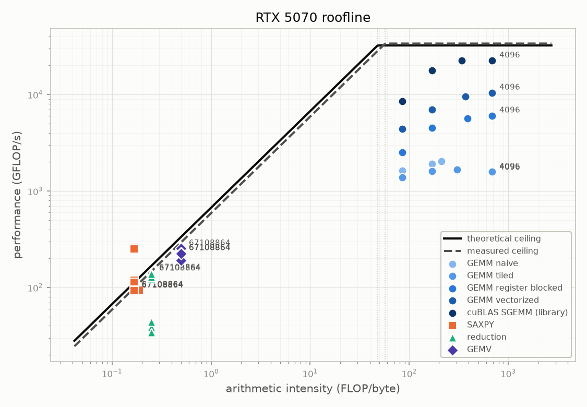

# GPU Roofline Profiler

A CUDA profiling suite for my RTX 5070. It measures this machine's peak compute
throughput and memory bandwidth (both theoretical and empirically measured),
places a ladder of hand written kernels on a roofline plot against those
ceilings, and explains each kernel's position with real Nsight Compute counters,
all compiled into one LaTeX PDF report.

The point is not another GEMM. The point is the ladder from SAXPY to a register
blocked GEMM walking the arithmetic intensity axis, with a counter backed reason
for where each kernel lands, and an honest accounting of the gap between the
vendor spec sheet and what the card actually delivers. The most interesting
result in the project is a place where the textbook optimisation did not work,
and the counters explain why.



## Measured ceilings

| Ceiling | Theoretical | Measured | Ratio |
| --- | --- | --- | --- |
| FP32 compute | 32.26 TFLOP/s | 33.49 TFLOP/s | 104 % |
| DRAM bandwidth | 672.0 GB/s | 591.6 GB/s | 88 % |
| Ridge point | 48.0 FLOP/byte | 56.6 FLOP/byte | |

The measured compute ceiling exceeds the theoretical one, which looks impossible
until the NVML trace explains it: the card boosts to 2865 MHz while the CUDA
runtime reports a nominal 2625 MHz. Recomputed at the clock it actually ran, the
FMA microbenchmark reaches 95 % of peak.

## Three findings

**Shared memory tiling did not beat the naive GEMM.** Both sit near 1.55
TFLOP/s at 4096. The counters say why: their L2 hit rates are identical, and both
move DRAM traffic at 5 to 8 GB/s against a 604 GB/s ceiling, so neither is close
to memory bound. This card's 48 MB L2 already absorbs over 99.8 % of the naive
kernel's redundant loads, leaving tiling nothing to remove and only its
synchronisation cost to pay. Register blocking, which cuts the number of requests
rather than their distance, does pay: near four times the naive kernel.

**The bank conflict counter found a bug in my own kernels.** I applied the
`[TILE][TILE+1]` padding to the transpose and left every GEMM tile unpadded,
which cost 134.5 M shared bank conflicts in the register blocked kernel. Padding
them gained 18 % on the vectorized rung (8746 to 10325 GFLOP/s) and nothing
measurable on the other two, which is reported as measured rather than as a
blanket win.

**Small kernels measure cache, not DRAM.** SAXPY appears to reach 1583 GB/s at 4M
elements, which is impossible on a 672 GB/s bus. At that size the working set
fits in L2. Past the cache it settles at 560 to 566 GB/s, and at 16M elements it
achieves 607 GB/s of real DRAM traffic against a 604 GB/s measured ceiling, which
is the anchor check that says the harness is sound.

## Measured runtime

Replacing the estimates in the build spec with wall clock from this machine:

| Pass | Estimated | Measured |
| --- | --- | --- |
| Timing sweep (62 cells) | 15 to 45 min | **31 s** |
| Nsight Systems pass | part of 1 to 4 h | **34 s** |
| Nsight Compute pass (7 cells) | dominates | a few minutes |

The sweep is far quicker than estimated because the harness calibrates how many
launches to put between a pair of CUDA events, targeting a 50 ms batch, instead
of using one fixed count for kernels whose cost differs by four orders of
magnitude.

## Target machine

| Component | Spec |
| --- | --- |
| CPU | Intel Core i7-14700K |
| RAM | 32 GB DDR5 |
| GPU | NVIDIA GeForce RTX 5070, 12 GB GDDR7, Blackwell (GB205), sm_120 |
| OS | Windows 11 Pro |
| Toolchain | CUDA 13.3.73, MSVC 14.44, Nsight Compute 2026.2.1, Nsight Systems 2026.1.3 |

All performance numbers in this repo come from runs on this GPU. Nothing from a
spec sheet is ever presented as measured.

## Quickstart

```powershell
# 1. Assemble the build environment (refreshes PATH, imports vcvars, adds nsys).
. .\scripts\dev_env.ps1

# 2. Build.
cmake -S . -B build -G Ninja
cmake --build build

# 3. Correctness first: no kernel is timed until these pass.
.\build\tests\cpp\kernel_tests.exe

# 4. Run the sweep.
.\build\roofline_profiler.exe --config configs\sweep.yaml --out results\raw\myrun

# 5. Profile. nsys needs no elevation; ncu needs an ADMIN shell.
.\scripts\run_nsys_profile.ps1
.\scripts\run_ncu_profile.ps1        # from an elevated PowerShell

# 6. Regenerate every figure and table, then build the reports.
python python\cli.py --results results\raw\myrun --report report `
    --peaks results\raw\myrun\peaks.csv --ncu results\raw\ncu_<stamp>
.\scripts\build_reports.ps1
```

Python side, for the analysis package:

```powershell
py -3.14 -m venv .venv
.\.venv\Scripts\python.exe -m pip install -r requirements.txt
.\.venv\Scripts\python.exe -m pytest python -q
```

## Repository layout

```text
src/         CUDA kernels, profiling utilities, benchmark driver
configs/     sweep parameters (YAML); changing a sweep never touches source
tests/       GoogleTest correctness tests
python/      roofline analysis package, CLI, and its pytest suite
scripts/     dev env, pipeline, nsys/ncu wrappers, style checks
docs/        architecture, methodology, kernel notes, profiling guide, logs
report/      main LaTeX report
report_debug/  engineering postmortem report
report_for_me/ standalone personal documentation report
results/     committed sample dataset plus the compiled report PDF
```

## Known limitations

- **Nsight Compute needs administrator rights on Windows.** Without them it
  attaches, runs the kernel, and returns `n/a` for every counter *without
  erroring*, which is the most dangerous failure mode in the whole pipeline. The
  wrapper script gates on elevation and counts `n/a` values after every pass.
- **Counter names are device specific.** This chip uses `dram__bytes_op_read`,
  not the `dram__bytes_read` in most published examples, and `ncu` accepts the
  wrong name silently. The verified mapping is in `docs/profiling_guide.md`.
- **One counter is physically impossible.** The naive GEMM reports a 100.39 % L2
  hit rate. It is reported as measured and flagged rather than clamped.
- **The tensor core (WMMA) panel is not built.** It needs its own compute
  ceiling and belongs on a separate axis.
- **CI has no GPU.** It compiles the `.cu` files and runs the CPU side tests
  only; GPU correctness and performance are not CI testable, and the workflow
  says so.

## License

MIT. See [LICENSE](LICENSE).
