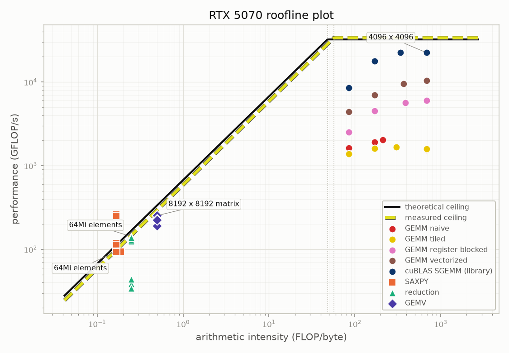
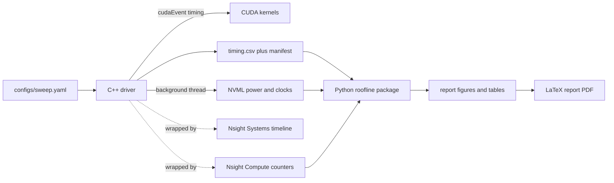

# GPU Roofline Profiler

[](https://github.com/Olajide-Badejo/GPU-Roofline-Profiler/actions/workflows/ci.yml)
[](LICENSE)

-76B900.svg)

A CUDA profiling suite for the NVIDIA RTX 5070. It measures the card's real
compute and memory ceilings, places a ladder of hand written kernels from SAXPY
to a register blocked GEMM on a roofline against those ceilings, and explains
where each kernel lands using real Nsight Compute counters. Everything is
compiled into a fully generated LaTeX report.

The point is not another fast GEMM. It is the counter backed account of *why*
each kernel sits where it does, and an honest measurement of the gap between the
vendor spec sheet and what the silicon actually delivers. The most interesting
result in the project is a place where the textbook optimisation did not help,
and the counters explain why.

<p align="center">
  
</p>

## Reports

Both documents are generated end to end from the measured data; no number in
either is typed by hand.

- **[Main report (PDF)](assets/reports/main_report.pdf)** the full write up:
  roofline background, methodology, kernel implementations, results, and the
  counter backed bottleneck analysis.
- **[Debug report (PDF)](assets/reports/debug_report.pdf)** a first person
  engineering postmortem: every significant bug, how it was diagnosed, and why
  each fix was chosen over the alternatives.

## Measured ceilings

| Ceiling | Theoretical | Measured | Ratio |
| --- | ---: | ---: | ---: |
| FP32 compute | 32.26 TFLOP/s | 33.49 TFLOP/s | 104 % |
| DRAM bandwidth | 672.0 GB/s | 591.6 GB/s | 88 % |
| Ridge point | 48.0 FLOP/byte | 56.6 FLOP/byte | |

The measured compute ceiling *exceeds* the theoretical one, which looks
impossible until the NVML trace explains it: the card boosts to 2865 MHz while
the CUDA runtime reports a nominal 2625 MHz. Recomputed at the clock it actually
ran, the FMA microbenchmark reaches 95 % of peak. This is exactly the kind of
anomaly the background power and clock monitor exists to resolve.

## Three findings

**Shared memory tiling did not beat the naive GEMM.** Both sit near 1.55
TFLOP/s at 4096. The counters say why: their L2 hit rates are identical, and both
move DRAM traffic at 5 to 8 GB/s against a 604 GB/s ceiling, so neither is close
to memory bound. This card's 48 MB L2 already absorbs over 99.8 % of the naive
kernel's redundant loads, leaving tiling nothing to remove and only its
synchronisation cost to pay. Register blocking, which cuts the *number* of
requests rather than their distance, does pay: close to four times the naive
kernel.

**A hardware counter found a bug in the kernels.** The shared memory bank
conflict counter read 134.5 M for the register blocked GEMM against 40 k for the
padded transpose. The `[TILE][TILE+1]` padding trick had been applied to the
transpose and left off every GEMM tile. Fixing it gained 18 % on the vectorized
rung (8746 to 10325 GFLOP/s) and nothing measurable on the other two, reported
as measured rather than as a blanket win.

**Small kernels measure cache, not DRAM.** SAXPY appears to reach 1583 GB/s at 4M
elements, which is impossible on a 672 GB/s bus, because at that size the working
set fits in L2. Past the cache it settles at 560 to 566 GB/s, and at 16M elements
it achieves 607 GB/s of real DRAM traffic against a 604 GB/s measured ceiling,
the anchor check that says the harness is sound.

## How it fits together



Every run writes a timestamped directory with a manifest recording the resolved
config, the driver and CUDA versions, and the exact Nsight tool versions, so any
result can be traced back to the run that produced it.

## The kernel ladder

Each rung raises the reuse of every value fetched from memory, which is what
moves it rightward along the arithmetic intensity axis and upward toward the
compute ceiling.

| Kernel | What it teaches |
| --- | --- |
| SAXPY | the memory bound left edge; the harness anchor |
| Reduction | shared memory and synchronisation, tested at non power of two sizes |
| Transpose (naive vs tiled) | coalescing and bank conflicts, isolated with zero arithmetic |
| GEMV | low reuse, mid axis |
| GEMM naive | correct baseline, reloads every operand from DRAM |
| GEMM tiled | stages tiles in shared memory |
| GEMM register blocked | each thread computes a 4x4 output tile in registers |
| GEMM vectorized | float4 loads and stores |
| cuBLAS SGEMM | the vendor reference ceiling, labelled as a library |

## Quickstart

Built and measured on the target machine (Windows 11, RTX 5070). The whole
pipeline runs from one command:

```powershell
. .\scripts\dev_env.ps1          # assemble the CUDA + MSVC build environment
.\scripts\run_full_pipeline.ps1  # build, test, sweep, profile, analyse, report
```

Or step by step:

```powershell
cmake -S . -B build -G Ninja
cmake --build build
.\build\tests\cpp\kernel_tests.exe          # correctness first: no kernel is timed until these pass
.\build\roofline_profiler.exe --config configs\sweep.yaml --out results\raw\myrun
.\scripts\run_nsys_profile.ps1              # timeline (no elevation needed)
.\scripts\run_ncu_profile.ps1               # counters (run from an elevated shell)
python python\cli.py --results results\raw\myrun --report report `
    --peaks results\raw\myrun\peaks.csv --ncu results\raw\ncu_<stamp>
.\scripts\build_reports.ps1
```

Python analysis package, which is fully testable without a GPU:

```powershell
py -3.14 -m venv .venv
.\.venv\Scripts\python.exe -m pip install -r requirements.txt
.\.venv\Scripts\python.exe -m pytest python -q
```

## Repository layout

```text
src/         CUDA kernels, profiling utilities, benchmark driver
configs/     sweep parameters (YAML); changing a sweep never touches source
tests/       GoogleTest GPU correctness tests
python/      roofline analysis package, CLI, and its pytest suite
scripts/     dev environment, full pipeline, nsys/ncu wrappers, style checks
docs/        architecture, methodology, kernel notes, profiling guide, logs
report/      main LaTeX report
report_debug/  engineering postmortem report
results/     committed sample dataset plus the compiled report
assets/      figures and PDFs shown here
```

## Testing and CI

GPU correctness is validated locally against a CPU reference at small sizes and
cuBLAS at large sizes, with 39 GoogleTest cases that must pass before any kernel
is timed. The Python roofline math and data loaders are covered by 48 pytest
cases.

CI has no GPU, so it does what it honestly can: compile every CUDA translation
unit with `nvcc`, run the Python tests and linters, enforce the style rules, and
rebuild the report from the committed sample dataset. That boundary is stated
rather than hidden.

## Toolchain

CUDA 13.3.73, MSVC 14.44 (Visual Studio Build Tools 2022), Nsight Compute
2026.2.1, Nsight Systems 2026.1.3, Ninja 1.12, CPython 3.14, MiKTeX. Full details
in [results/sample_run/environment.txt](results/sample_run/environment.txt).

## Known limitations

- **Nsight Compute needs administrator rights on Windows.** Without them it runs
  the kernel and returns `n/a` for every counter with no error, the most
  dangerous failure mode in the pipeline. The wrapper gates on elevation and
  counts `n/a` values after every pass.
- **Counter names are device specific.** This chip uses `dram__bytes_op_read`,
  not the `dram__bytes_read` in most published examples, and `ncu` accepts the
  wrong name silently. The verified mapping is in
  [docs/profiling_guide.md](docs/profiling_guide.md).
- **One counter is physically impossible.** The naive GEMM reports a 100.39 % L2
  hit rate; it is reported as measured and flagged, never clamped.
- **The tensor core (WMMA) panel is not built.** It needs its own compute
  ceiling on a separate axis and is left as future work.

## License

MIT. See [LICENSE](LICENSE).
